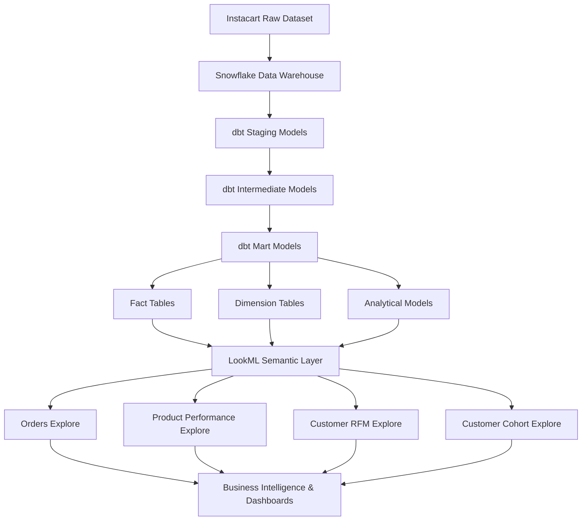
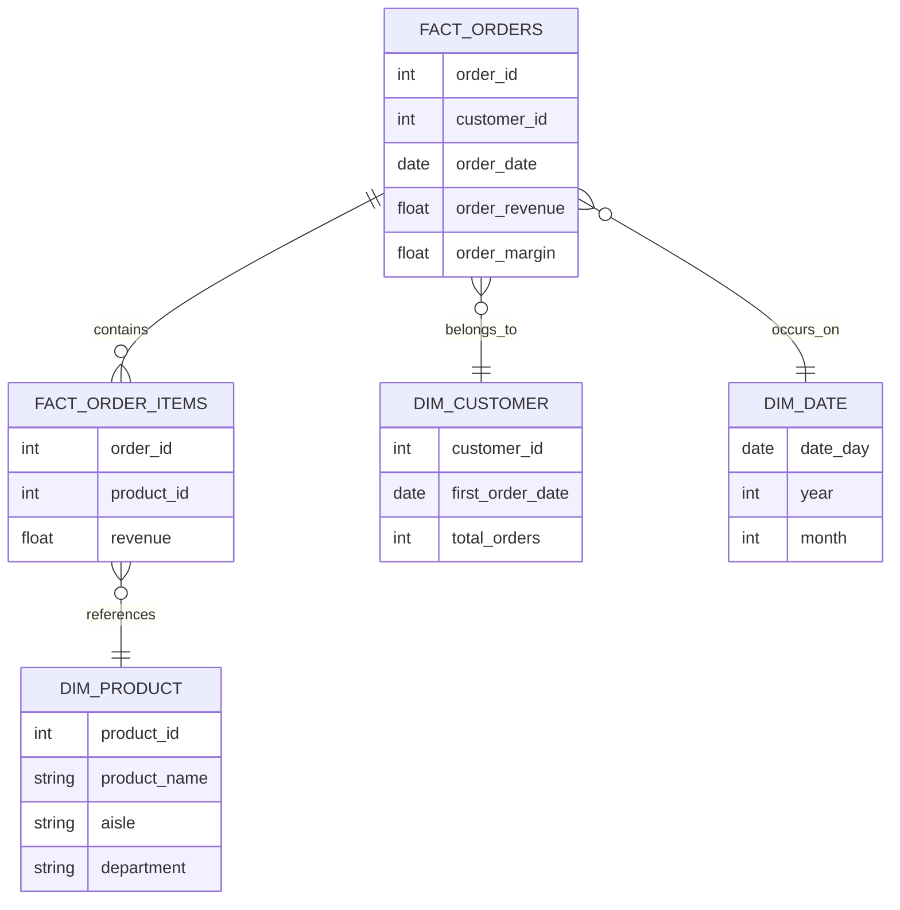

# Instacart Analytics Engineering Project

This repository demonstrates an **end-to-end analytics engineering workflow** built using the Instacart dataset.

* 📧 Email: albertnsql@gmail.com
* 💼 LinkedIn: https://www.linkedin.com/in/albertn97

The project models **orders, products, and customer behavior** using a modern analytics stack and implements a semantic layer for business-ready analytics.

## Stack

* **Snowflake** — Cloud data warehouse
* **dbt** — Data transformation & warehouse modeling
* **LookML** — Semantic layer for reusable business metrics
* **SQL** — Analytical modeling

The goal of this project is to design a **scalable analytics warehouse and semantic layer** that enables consistent reporting across revenue, product performance, and customer analytics.

---

# Project Highlights

* Built an **end-to-end analytics engineering pipeline** using Snowflake, dbt, and LookML
* Designed a **star schema data warehouse** with fact tables, dimension tables, and analytical marts
* Implemented advanced analytics models including **Customer RFM segmentation** and **Customer Cohort retention analysis**
* Developed a **LookML semantic layer** with reusable explores, dimensions, and business metrics
* Modeled **revenue, product performance, customer behavior, and retention analytics**
* Structured the repository following a **modern analytics engineering project layout**

---

# Architecture Overview



---

# Warehouse Schema

The analytics warehouse follows a **star schema design optimized for analytical queries**.



---

# Data Model Overview

## Fact Tables

| Table            | Grain                         | Description                                              |
| ---------------- | ----------------------------- | -------------------------------------------------------- |
| fact_orders      | One row per order             | Contains order revenue, cost, margin, and basket metrics |
| fact_order_items | One row per product per order | Line-item level product purchases and reorder behavior   |

---

## Dimension Tables

| Table        | Description                                       |
| ------------ | ------------------------------------------------- |
| dim_customer | Customer attributes and lifetime metrics          |
| dim_product  | Product attributes including aisle and department |
| dim_date     | Calendar dimension used for time-based analytics  |

---

## Analytical Marts

| Table               | Purpose                                                          |
| ------------------- | ---------------------------------------------------------------- |
| product_performance | Product-level revenue, margin, and reorder analysis              |
| customer_rfm        | Customer segmentation using Recency, Frequency, Monetary metrics |
| customer_cohorts    | Customer retention analysis using cohort modeling                |

---

# Metrics Layer

The semantic layer defines reusable business metrics used across analytics and reporting.

## Revenue Metrics

| Metric              | Definition                           |
| ------------------- | ------------------------------------ |
| Total Revenue       | Sum of product revenue across orders |
| Total Margin        | Revenue minus product cost           |
| Average Order Value | Revenue per order                    |

Formula:

AOV = Total Revenue / Total Orders

---

## Customer Metrics

| Metric    | Definition                            |
| --------- | ------------------------------------- |
| Recency   | Days since the last order             |
| Frequency | Total orders placed by a customer     |
| Monetary  | Total revenue generated by a customer |

These metrics power **RFM customer segmentation**.

---

## Product Metrics

| Metric        | Definition                                           |
| ------------- | ---------------------------------------------------- |
| Total Orders  | Number of orders containing the product              |
| Total Revenue | Revenue generated by the product                     |
| Reorder Rate  | Percentage of orders where the product was reordered |
| Average Price | Average selling price of the product                 |

---

## Retention Metrics

| Metric           | Definition                                    |
| ---------------- | --------------------------------------------- |
| Active Customers | Customers placing an order in a cohort period |
| Cohort Index     | Months since first purchase                   |
| Retention Rate   | Percentage of customers returning over time   |

---

# Project Structure

```
instacart-analytics-dbt-looker
│
├── dbt/
│   Data warehouse transformations and analytics marts
│
├── lookml/
│   LookML semantic layer defining explores, dimensions, and measures
│
└── README.md
```

---

# Example Business Questions

### Revenue Analytics

* What is the average order value by month?
* Which products generate the highest revenue?

### Customer Analytics

* Which customers have the highest lifetime value?
* Which customers are likely to churn?

### Retention Analysis

* What percentage of customers return after their first order?
* How do retention cohorts behave over time?

### Product Analytics

* Which products drive the highest margin?
* What products have the highest reorder rate?

---

# Key Concepts Demonstrated

* Modern analytics stack architecture
* dbt layered modeling (staging → intermediate → marts)
* Star schema warehouse design
* Customer segmentation using RFM analysis
* Customer retention cohort modeling
* LookML semantic modeling

---

# Looker Dashboard Note

This repository focuses on the **analytics engineering layer** of the stack, including warehouse modeling with dbt and semantic modeling using LookML.

Due to the lack of access to a hosted Looker instance, interactive dashboards are not included in this repository.

However, the LookML semantic layer defines reusable **dimensions, measures, and explores** that can power dashboards such as:

* Revenue and order performance dashboards
* Product performance analysis
* Customer segmentation dashboards
* Customer retention cohort analysis

The focus of this project is on **data modeling, metric definition, and semantic layer design**, which form the foundation of scalable business intelligence systems.
