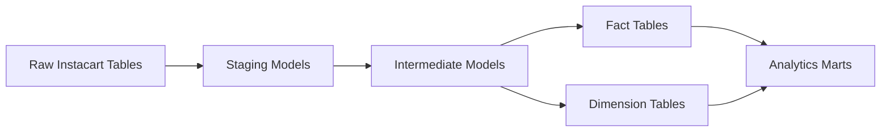
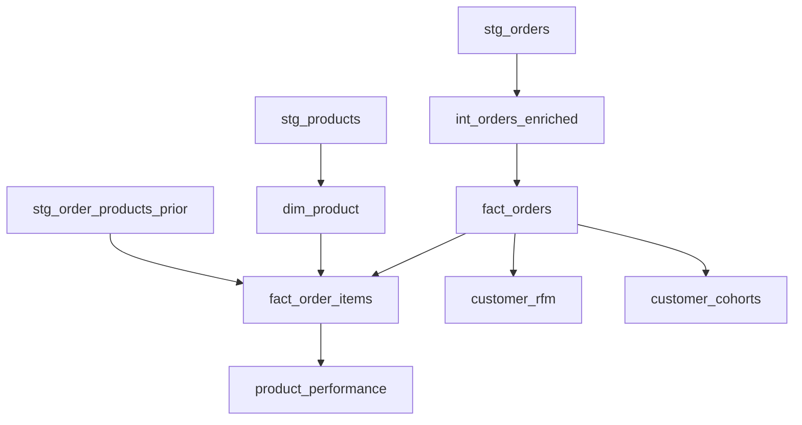

# dbt Data Warehouse Models

This directory contains the **dbt project responsible for transforming raw Instacart data into analytics-ready warehouse models**.

The dbt project follows a layered modeling approach that improves **data quality, maintainability, and reusability**.

Raw Data → Staging Models → Intermediate Models → Mart Models

---

# dbt Transformation Pipeline



This layered approach ensures:

* Clear separation of transformations
* Reusable data models
* Scalable analytics pipelines

---

# Model Layers

## Staging Layer

Location:

```
models/staging
```

Purpose:

* Clean raw source tables
* Standardize column names
* Apply basic transformations

Examples:

* stg_orders
* stg_products
* stg_order_products_prior
* stg_departments
* stg_aisles

---

## Intermediate Layer

Location:

```
models/intermediate
```

Purpose:

* Build reusable transformations
* Combine staging models
* Prepare datasets for analytics marts

Example:

* int_orders_enriched

---

## Mart Layer

Location:

```
models/marts
```

Purpose:

* Create analytics-ready tables used by BI tools.

Key models:

### Fact Tables

* fact_orders
* fact_order_items

### Dimension Tables

* dim_customer
* dim_product
* dim_date

### Analytical Models

* product_performance
* customer_rfm
* customer_cohorts

---

# dbt Model Dependencies



---

# Key dbt Features Used

* Layered data modeling (staging → intermediate → marts)
* Incremental models for large fact tables
* Modular SQL transformations
* Reusable analytics marts
* Documentation via YAML schema files

---

